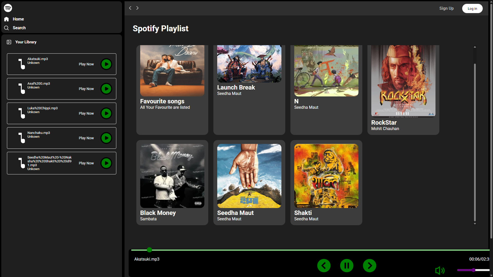

# 🎵 Music Player Web App (Spotify-Inspired)

A **static** web-based music player built with HTML, CSS, and JavaScript.  
It allows you to browse local albums, view album art, and play MP3 tracks directly from your browser.

> **Disclaimer:** This project is not affiliated with or endorsed by Spotify.  
> All branding, trademarks, and logos belong to their respective owners.  
> This is for educational and portfolio purposes only.

---

## 🚀 Features

- Responsive **Spotify-like UI**
- Play/Pause, Next/Previous track controls
- Seek bar with progress display
- Volume control with mute/unmute option
- Album cards with hover animations
- Local MP3 file playback
- Minimal, modern design with Roboto font

---

## 📂 Project Structure
.
├── index.html # Main page
├── style.css # Styling
├── script.js # JavaScript logic
├── songs/ # Local MP3 files
├── img/ # Album artwork
└── README.md

## 🖼️ Preview



---

## 📦 Setup & Usage

1. **Clone the repository**
   ```bash
   git clone https://github.com/Viper107/music-player.git
   cd music-player
2. Add your songs and images

    Put .mp3 files into the songs directory.
    
    Put album artwork into the img directory.

3. Run a local server
    Since browsers block local audio file loading for security, run a simple HTTP server:
   # Python 3
  python -m http.server 8000

or

  # Node.js
  npx serve

4.Open in browser
  Go to http://localhost:8000
